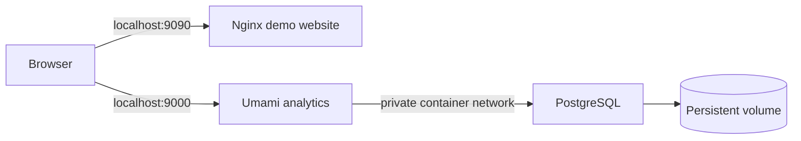

# Linux Web Analytics Lab

A university learning project by **Mohammed Abdulwareth**, a Computer Science student at **HTW Berlin**. It brings together Linux, Bash, networking, Git and Infrastructure as Code by running a small website and an analytics service in containers.

Originally developed for **Praktische Grundlagen der Informatik** on the university's GitLab. This repository is a cleaned and documented portfolio edition of that work.

## What the project does

- Serves a German demo page with **Nginx**.
- Runs **Umami** to collect website analytics after a website ID is configured.
- Stores analytics in a persistent **PostgreSQL** volume.
- Uses **Podman and Compose** to describe the services, network and storage.
- Provides Bash scripts for local configuration, deployment, SSH file transfer and HTTP checks.
- Checks Bash syntax, configuration validation and template rendering in CI.

The application components are existing open-source software. My work is the configuration, automation and learning project around them; I did not build Nginx, PostgreSQL or Umami.

## Architecture



Both HTTP ports bind to `127.0.0.1` by default. PostgreSQL has no published host port. The demo page loads Umami's tracker only after `UMAMI_WEBSITE_ID` is set.

## Requirements

- A Linux machine with Bash, Podman and a Compose provider (`podman-compose` is recommended).
- `openssl` and `curl`; `rsync` and SSH for optional remote copying.
- Internet access on the first start to download container images.
- On Windows, run the containers in Linux or a configured WSL environment. Git Bash can run the file checks, but it does not provide a Linux container runtime.

On Debian/Ubuntu, inspect `scripts/system_setup.sh` before running:

```bash
sudo bash scripts/system_setup.sh
```

Run the following project commands as your regular user.

## Quick start

```bash
git clone https://github.com/mohammedaslwiy/linux-web-analytics-lab.git
cd linux-web-analytics-lab
bash scripts/init_env.sh
bash deploy/user_deploy.sh
bash scripts/check_services.sh
```

Open the demo at **http://localhost:9090** and Umami at **http://localhost:9000**. First database initialization can take a few minutes. If the HTTP check fails immediately, inspect the logs and retry after startup.

`init_env.sh` generates fresh random hexadecimal secrets in `deploy/.env` and keeps an existing file unchanged. This local file is ignored by Git. The checked-in `.env.example` contains placeholders only.

### Enable website analytics

1. Sign in to the local Umami installation. Its documented initial account is `admin` with password `umami`; change that password after signing in.
2. Add a website for `localhost` in Umami and copy its website ID.
3. Set `UMAMI_WEBSITE_ID` in `deploy/.env` to that ID.
4. Run `bash scripts/render_site.sh`, then visit the demo page again.
5. Check for the visit in the Umami dashboard. Browser blockers can prevent tracking.

The site is rendered from a template on every run, so changing the host or port works without replacing an earlier generated value manually.

### Configuration

| Setting | Purpose | Default |
| --- | --- | --- |
| `DB_NAME`, `DB_USER` | Database name and user | `umami` |
| `DB_PASSWORD`, `APP_SECRET` | Local random secrets | Generated by the initializer |
| `WEB_PORT` | Demo website port | `9090` |
| `UMAMI_PORT` | Analytics port | `9000` |
| `BIND_ADDRESS` | Host interface for both services | `127.0.0.1` |
| `VM_IP_OR_DOMAIN` | Host used by the browser and HTTP checks | `localhost` |
| `UMAMI_WEBSITE_ID` | ID from the Umami dashboard | Blank; tracking disabled |

Use simple, unquoted `KEY=value` entries. Database identifiers use letters, numbers and underscores; secrets use hexadecimal characters to avoid connection-string escaping issues. The two ports must differ and be in the range 1024-65535. The scripts read settings as text instead of executing the `.env` file.

### Status, logs and stopping

From the repository root:

```bash
cd deploy
podman-compose -p web-analytics-lab ps
podman-compose -p web-analytics-lab logs --tail=100
podman-compose -p web-analytics-lab down
```

`down` stops this project's services and preserves the database volume. Avoid adding `-v` if you want to keep the analytics data. Deployment does not remove unrelated containers or prune other networks.

### Remote Linux VM

Copy the files to a destination you control:

```bash
bash upload.sh user@your-server:/home/user/web-analytics-lab
```

The upload excludes `.git`, `.env`, editor swap files and the generated site. Create a fresh `.env` and run deployment on the destination. The transfer does not delete remote files.

To use a VM while retaining localhost-only services, open an SSH tunnel from your computer:

```bash
ssh -L 9090:127.0.0.1:9090 -L 9000:127.0.0.1:9000 user@your-server
```

Then open the same localhost URLs in your browser. Port changes must also be reflected in the tunnel. Persistent startup after reboot is a future improvement; this edition does not install user systemd services automatically.

## Repository layout

```text
deploy/
  .env.example          Safe configuration template
  compose.yaml          Nginx, Umami and PostgreSQL services
  index.template.html   Original German demo page template
  html/.gitkeep         Mount directory; generated index.html is ignored
  user_deploy.sh        Project-scoped deployment
scripts/
  init_env.sh           Generate local secrets
  load_env.sh           Read and validate configuration
  render_site.sh        Generate the demo page
  check_services.sh     Check both HTTP endpoints
  system_setup.sh       Debian/Ubuntu prerequisites
tests/check.sh          File and script behavior checks
docs/course-notes-de.md Original German learning notes
docs/portfolio-changes.md Review changes and validation limits
upload.sh               Optional SSH/rsync transfer
.github/workflows/      GitHub checks
.gitlab-ci.yml          Equivalent Bash checks for GitLab
```

## Validation and learning goals

```bash
bash tests/check.sh
```

These checks exercise configuration validation, secret initialization, repeatable template rendering, protection from shell execution in configuration, and HTTP-check exit codes with a stub. GitHub Actions also validates the Compose configuration with Docker Compose. The checks do not prove that the full analytics stack has started successfully.

The portfolio preparation was tested with Git Bash on Windows. Podman/WSL was not installed in that review environment, so a fresh end-to-end container run remains to be verified on Linux. The original project was developed on Linux; the README does not claim a new successful deployment of this edition.

Through this project I practice shell scripting, file permissions, service ports, container networking, persistent storage, Git workflows and documenting reproducible setup steps.

## Next improvements

- Verify a fresh Linux deployment and add screenshots of actual services.
- Pin tested image versions or digests; the current image tags can change upstream.
- Add database backup and restore exercises.
- Add explicit user-service startup with Podman Quadlet after testing on Linux.

This is a learning lab with HTTP and local access defaults. Public production hosting would need a separate deployment design with TLS, access controls, tested updates and backups.

## Background and references

The original German [course notes](docs/course-notes-de.md) are preserved. See [portfolio changes](docs/portfolio-changes.md) for how the GitLab project was prepared for this repository, including AI assistance and the reason the old history was kept separately.

- [Podman Compose documentation](https://docs.podman.io/en/latest/markdown/podman-compose.1.html)
- [Umami installation](https://docs.umami.is/docs/install)
- [Umami environment variables](https://docs.umami.is/docs/environment-variables)
- [GitHub Actions workflows](https://docs.github.com/en/actions/tutorials/create-an-example-workflow)
